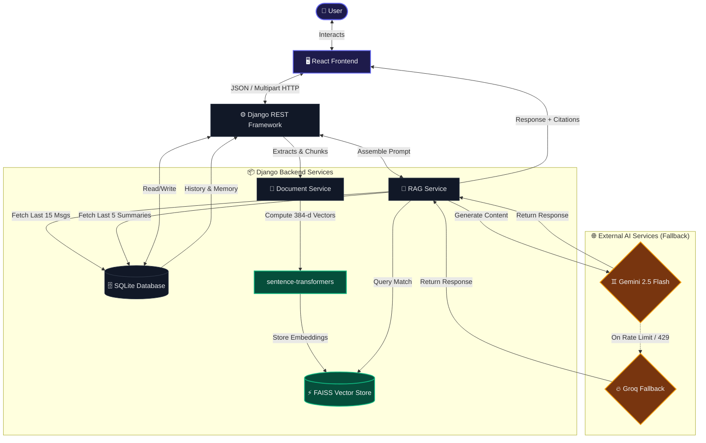

# 🛡️ SecureDocs AI — RAG-Based Document Intelligence System

[](https://python.org)
[](https://djangoproject.com)
[](https://react.dev)
[](https://vite.dev)
[](https://ai.google.dev/)
[](https://groq.com)

**SecureDocs AI** is an enterprise-grade Retrieval-Augmented Generation (RAG) system built with **Django REST Framework** (Backend) and **React + Vite** (Frontend). It enables secure, local-first document indexing and context-grounded AI conversations. By combining sentence-level vector searches with a dual-layer memory architecture and multi-provider LLM fallbacks, SecureDocs AI delivers fast, highly reliable, and grounded answers with exact source citations.

---

## 🎨 User Interface & Experience

The application is engineered with a modern, high-fidelity liquid glassmorphism interface, featuring micro-interactions and smooth state transitions.

| Component | UI Design Styling | Functional Highlight |
| :--- | :--- | :--- |
| **🌌 Liquid Backdrop** | Custom HSL CSS Radial Gradients | Active background animation providing a premium depth-of-field experience. |
| **⚡ Glassmorphic Sidebar** | CSS Backdrop-Filter (`blur`) & Flexbox | Interactive, collapsible repository layout managing all active chat threads and uploaded files. |
| **💬 Streamlined Chat Window** | Dynamic Bubbles & Scroll Anchoring | Clean, alternating speech blocks with instant auto-scroll and auto-resizing text area. |
| **🔖 Smart Citations** | Floating Source Cards & Badges | Highlights the exact document chunk retrieved by the vector engine, complete with metadata. |

---

## ⚡ Core Technical Pillars

| Technical Pillar | Technology | Functional Specification |
| :--- | :--- | :--- |
| **🧠 Dual-Layer Memory** | `SQLite` + `Django ORM` | **Short-Term Context:** Retains the last 15 messages in the active thread for smooth conversation flow.<br>**Long-Term Context:** Auto-generates summaries of the 5 most recent chat sessions, injection-feeding historical context into new prompts. |
| **🔄 High-Availability LLM** | `Gemini 2.5` ➔ `Groq API` | **Cascade Auto-Retry:** Cascades queries through `gemini-2.5-flash`, `gemini-3.5-flash`, and `gemini-flash-latest` with intelligent rate-limit retries.<br>**Failover Provider:** Automatically switches providers to Groq (`llama-3.1-8b-instant`) if Gemini limits are exhausted. |
| **⚡ Offline Local Embeddings** | `SentenceTransformers` | **Zero API Costs:** Local processing of 384-dimensional text embeddings using the `all-MiniLM-L6-v2` model.<br>**Ultra-Fast Indexing:** High-speed vector generation running entirely on-device. |
| **🔍 Vector Similarity Search** | `FAISS` (CPU) | **Chunk Retrieval:** Indexes doc chunks locally. When a question is asked, it queries the index and returns the top 4 matching document contexts. |
| **📂 Document Ingest Pipeline** | `pdfplumber` + `python-docx` | **Multi-Format Extraction:** Automatically handles plain `.txt`, complex tables in `.pdf`, and headers/lists in `.docx` documents. |
| **📝 Auto-Title Generator** | `google-genai` SDK | Uses the first user message in a chat to generate a concise, human-like title for the thread. |

---

## 🏗️ System Architecture & Workflow

The diagram below outlines the full data flow—from document indexing to context retrieval and LLM response generation:



---

## 🗂️ Project Directory Structure

```text
securedocs_ai/
├── backend/
│   ├── core/               # Main configuration (settings.py, urls.py)
│   ├── chats/              # Chat management, message histories & summaries
│   ├── documents/          # Document uploads, text extraction pipelines
│   ├── rag/                # Embeddings, chunking, FAISS indexer, LLM integrations
│   ├── media/              # Dynamic uploaded documents & local FAISS indexes (Git-ignored)
│   ├── db.sqlite3          # SQLite Database (Git-ignored)
│   ├── manage.py           # Django management CLI
│   └── test_pipeline.py    # End-to-end backend verification pipeline
└── frontend/
    ├── src/
    │   ├── components/     # Reusable UI components (Sidebar, ChatWindow, etc.)
    │   ├── pages/          # Layout page elements (Home.jsx)
    │   ├── services/       # Axios API central configuration (api.js)
    │   └── App.jsx         # Root router component
    ├── package.json        # Frontend dependencies
    └── vite.config.js      # Vite build configurations
```

---

## 🚀 Getting Started

### 📋 Prerequisites
*   **Python 3.9+** installed
*   **Node.js (v18+)** and **npm** installed

---

### 🔧 1. Backend Setup

1.  **Navigate to the backend directory:**
    ```bash
    cd securedocs_ai/backend
    ```

2.  **Create and activate a virtual environment:**
    *   **Windows (PowerShell):**
        ```powershell
        python -m venv venv
        .\venv\Scripts\Activate.ps1
        ```
    *   **Linux/macOS:**
        ```bash
        python -m venv venv
        source venv/bin/activate
        ```

3.  **Install dependencies:**
    ```bash
    pip install -r requirements.txt
    ```

4.  **Configure environment variables:**
    *   Copy the `.env.example` template:
        ```bash
        cp .env.example .env
        ```
    *   Open `.env` and fill in your Gemini and Groq API keys:
        ```ini
        GEMINI_API_KEY=your_actual_gemini_key_here
        GROQ_API_KEY=your_actual_groq_key_here
        ```

5.  **Run migrations:**
    ```bash
    python manage.py migrate
    ```

6.  **Start Django server:**
    ```bash
    python manage.py runserver
    ```
    Backend will run on **`http://127.0.0.1:8000`**.

---

### 💻 2. Frontend Setup

1.  **Open a new terminal and navigate to the frontend directory:**
    ```bash
    cd securedocs_ai/frontend
    ```

2.  **Install Node packages:**
    ```bash
    npm install
    ```

3.  **Start Vite dev server:**
    ```bash
    npm run dev
    ```
    Frontend will run on **`http://localhost:5173`**.

---

## 🧪 Verification & Testing

To run the complete system verification suite (testing Django, database migrations, document extractors, FAISS vector indexing, memory systems, and LLM responses):

1.  Ensure the Django backend is running (`python manage.py runserver`).
2.  Open another terminal, enter the `backend` directory, activate the virtual environment, and run:
    ```bash
    python test_pipeline.py
    ```

Successful run output:
`[PASS] Gemini API responds` ... `ALL FEATURES VERIFIED AND WORKING!`

---

## 📜 License

Distributed under the MIT License. See `LICENSE` for more information.
